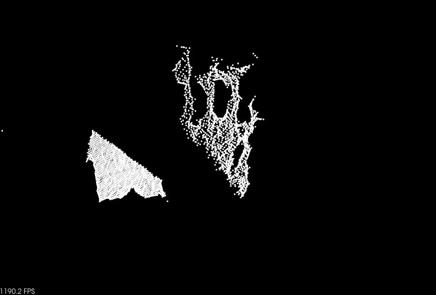
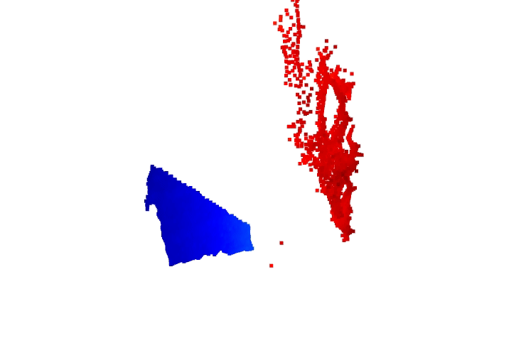
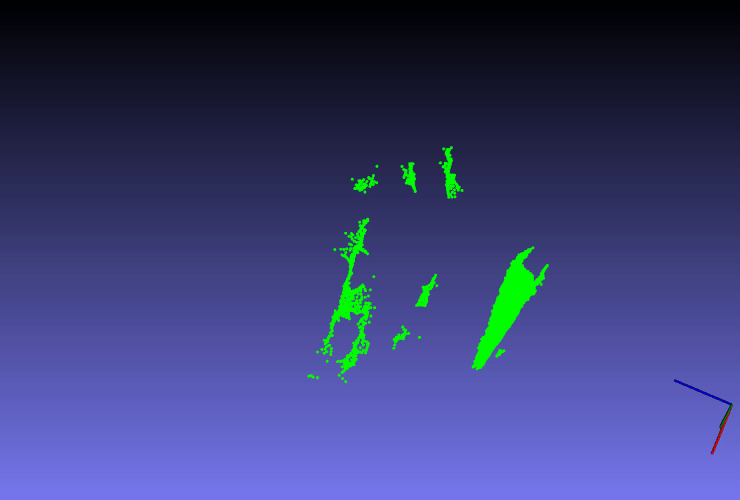

Introduction
============

MkE integration examples show how to use the MKE point cloud data in
these 3rd party libraries:

-   PCL (<https://pointclouds.org/>)

-   Open3D (<http://www.open3d.org/>)

-   OpenCV (<https://opencv.org/>)

Instruction for C++
===================

The officially supported target platforms for MkE integration examples
are Ubuntu 20.04 / Ubuntu 18.04 running on an AMD64 system. There is one
CMake file for all 3rd party libraries, but they are not meant to be
compiled all at once (due to collisions of 3rd party library
dependencies)

Dependencies
------------

### PCL

PCL and all its dependencies are to be installed.

    sudo apt install libpcl-dev

Installation guide is found in <https://pointclouds.org/downloads/> .

### Open3D

Open3D and all its dependencies to be installed. Installation guide is
found in
<http://www.open3d.org/docs/release/compilation.html#ubuntu-macos> .

### OpenCV

OpenCV and all its dependencies to be installed.

    sudo apt install libopencv-dev

Alternatively compilation from source:
<https://docs.opencv.org/master/d7/d9f/tutorial_linux_install.html> .

Building
--------

Building should be done from
[client/cpp/mkeclient/src/integration\_examples](../mkeclient/src/integration_examples)
directory. Building command sequence is:

    mkdir build && cd build
    cmake .. # Replace this line with one of the cmake lines below
    make

Turning on the flag MKE\_ENABLE\_VISU enables creating graphical window
with point cloud visualization. By default it is off.

### PCL Mode

The PCL mode can be enabled by using the flag MKE\_USE\_PCL. This
enables the custom client to receive the point cloud in PCL format.

    cmake -DMKE_USE_PCL=ON -DMKE_USE_OPEN3D=OFF -DMKE_USE_OPENCV=OFF -DMKE_ENABLE_VISU=ON ..

### Open3D Mode

The Open3D mode can be enabled by using the flag MKE\_USE\_OPEN3D. This
enables the custom client to receive the point cloud in Open3D format.

    cmake -DMKE_USE_PCL=OFF -DMKE_USE_OPEN3D=ON -DMKE_USE_OPENCV=OFF -DMKE_ENABLE_VISU=ON ..

### OpenCV Mode

The OpenCV mode can be enabled by using the flag MKE\_USE\_OPENCV. This
enables the custom client to receive the point cloud in OpenCV format.

    cmake -DMKE_USE_PCL=OFF -DMKE_USE_OPEN3D=OFF -DMKE_USE_OPENCV=ON -DMKE_ENABLE_VISU=ON ..

Execution
---------

-   Upon successful compilation of above cmake configurations, demo
    binaries can be started using this syntax:

-   `client_<XXX>_demo <ip-address> <port>`

-   `<ip-address>` and `<port>`: ip-address and port number of the
    sensor. Port number is optional and by default it takes 8888 port.

-   Examples:

<!-- -->

    ./client_pcl_demo 192.168.0.105 8888
    ./client_open3d_demo 192.168.0.105 8888
    ./client_opencv_demo 192.168.0.105 8888

### PCL Visualization

### Open3D Visualization

### OpenCV Visualization

Instruction for Python
======================

Dependencies:
-------------

Install all the dependencies as mentioned in the above steps for PCL and
Open3D along with python packages for PCL and Open3d.

For PCL install python-pcl PyPI package using the following command,

    sudo add-apt-repository ppa:sweptlaser/python3-pcl
    sudo apt update
    sudo apt install python3-pcl

For Open3d install the python package using make as mentioned in the
installation guide for Open3D.

Execution
---------

Execute the example files:

-   CLI Format: `PYTHONPATH=.. python3 <script>.py <ip-address> <port>`

-   `PYTHONPATH`: Give the python directory location where pymkeapi
    exists.

-   `<script>`: Script name

-   `<ip-address>` and `<port>`: Provide the IP address and port number
    of the sensor. Port number is optional and by default it takes 8888
    port.

-   Example:
    `PYTHONPATH=.. python3 client_pushframes_open3d.py 192.168.0.105`
