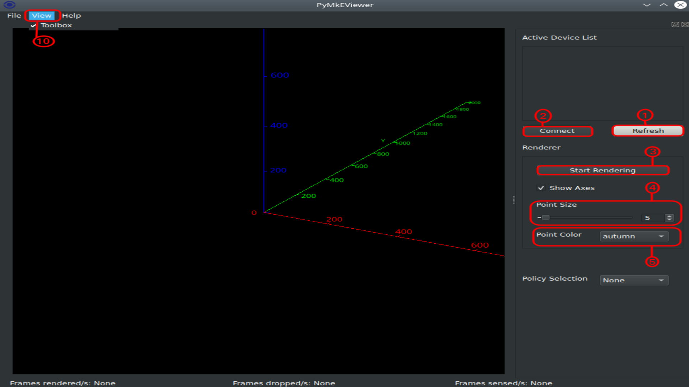

Introduction
============

PyMkEViewer, also spelled `pymkeviewer`, is an easy to use Python3 GUI
application which provides visualization of the 3D point clouds captured
by Magik Eye sensors. The application includes the features to detect
and connect to MKE sensors---*i.e.* it acts as a MkE API client
[\[mkeapi\]](#mkeapi)---and to render the data transmitted by the
sensor. The application allows the user to modify the point-size of the
points rendered and also to change the colormap of the rendered points.

Installation
============

The `pymkeviewer` application is distributed as a wheel file. The
officially supported system for `pymkeviewer` is Ubuntu 20.04, however,
it should execute an every system where `PySide2`
[\[pyside2\]](#pyside2) and `vispy` [\[vispy\]](#vispy) packages are
available. The following console command will install the wheel as well
as its depencencies into the system through the `pip3` utility:

    pip3 install pymkeviewer-X.Y.Z-py3-none-any.whl

The `X.Y.Z` stands for the version of the wheel package. Note that the
`pymkeviewer` also requires `pymkeapi`, a Python package implementing
the client-side of the MkE API [\[mkeapi\]](#mkeapi).

> **Warning**
>
> Installing `pymkeviewer` on Windows using Anaconda can result in
> errors if the environment variables aren’t set correctly. Make sure to
> set the `Library\plugins` subfolder in Anaconda as an environment
> variable `QT_PLUGIN_PATH` under
> `Control Panel/System/Advanced System Settings/Environment Variables`

Application Features
====================

The application is a simple visualization tool with the following
features:

1.  **Refresh** - Click on the ‘Refresh' button to discover any Magik
    Eye sensors are available on the local network. If sensor(s) are
    available, they will be listed on the ‘Active Devices’ list.

2.  **Connect/Disconnect** - In order to connect to a sensor, the sensor
    must be selected in the ‘Active Devices’ list. Next, the ‘Connect’
    button must be selected to establish a connection. Once the
    connection is established, the ‘Renderer’ layout buttons will be
    accessible and the title window will show the ID of the connected
    sensor. To close the connection to the sensor, click on the
    ‘Disconnect’ button.

3.  **Start Rendering/Stop Rendering** - Once a connection is
    established with the sensor, click on the ‘Start Rendering’ button
    to start receiving the 3D point cloud data from the sensor and to
    visualize the same on the viewer. To stop the 3D data stream and the
    visualization, the ‘Stop Rendering’ button must be clicked.

4.  **Point Size** - The value set using the track bar will relate to
    the size of the points being visualized.

5.  **Point Color** - A list of 25 colormaps are available in the
    drop-down list for Point Color. Each colormap will modify the color
    of points according to its depth.

6.  **3D Axis** - When checked, the 3D axis will be displayed in the
    viewer. This is useful for reference purposes, the button can be
    unchecked to remove the axis from the viewer.

7.  **Frames Rendered Per Second** - During rendering, this field will
    provide the FPS at which the application is currently rendering the
    point cloud data.

8.  **Frames Dropped Per Second (DFPS)** - During rendering, this field
    will provide the rate of frames being dropped per second.

9.  **Sensor Frames Per Second** - During rendering, this field will
    provide the true FPS at which the sensor is functioning.

10. **View** - The ‘View' menu bar option allows opening of and gives
    the option to show the dockable window.

11. **Help** - The ‘Help' menu bar option provides the licencing
    information and a brief summary of the application.

12. **Dockable window** - The dockable window holds all the interactive
    features of the application. This window can be undocked, moved, and
    closed for improving the viewer space during rendering. The window
    can be reopened by selecting the ‘Toolbox’ option in the ‘View’ menu
    bar option.

The viewer allows for a free rotation and translation. By clicking the
left mouse button and by dragging its pointer, the view can be rotated
along any axis. Performing the same with the shift key being pressed
will allow translation along two axis. The scroll button of the mouse
can be used to perform the zoom-in and zoom-out actions.

Bibliography
============

-   \[\] *MagikEye API v1.0*, 2020, Magik Eye Inc.

-   \[\] *Qt for Python*, <https://wiki.qt.io/Qt_for_Python>

-   \[\] *Vispy*, a high-performance interactive 2D/3D data
    visualization library, <https://vispy.org>
